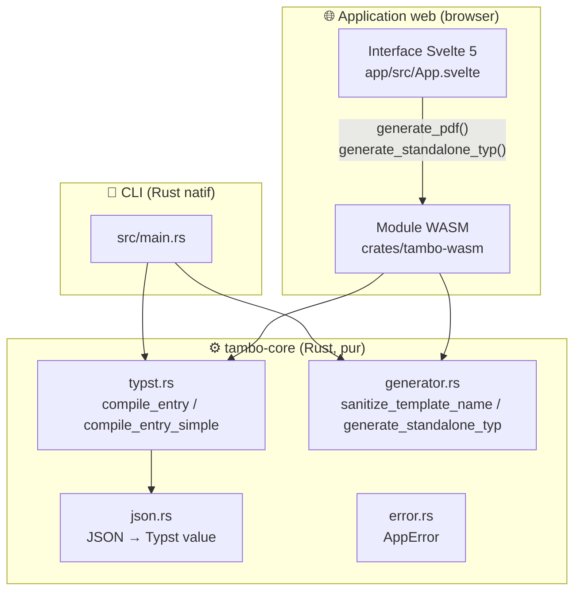

# 🖼️ tambo

> Générez des PDF d'exposition (cartes d'œuvres, notules…) depuis vos données JSON et des templates [Typst](https://typst.app), **entièrement dans votre navigateur**.

Tambo compile chaque entrée de votre fichier JSON vers un PDF en utilisant le template correspondant, puis vous restitue un archive ZIP avec, pour chaque objet, son PDF **et** un fichier `.typ` autonome recompilable.

---

## 👤 Guide utilisateur

### 🔒 Vos données restent sur votre machine

C'est le point le plus important : **aucune donnée ne quitte votre navigateur**.

- Le site est hébergé sur **GitHub Pages** : ce n'est qu'une page statique (HTML + JavaScript + WASM) — il n'y a **pas de serveur**.
- Toute la compilation Typst → PDF s'exécute **localement**, dans votre navigateur, grâce à un moteur Typst compilé en WebAssembly (WASM).
- Votre fichier JSON et vos templates sont lus depuis votre disque et traités en mémoire : rien n'est envoyé sur Internet.

> 💡 Vous pouvez vérifier en déconnectant votre réseau pendant la génération : tout continue de fonctionner.

### 🚀 Démarrage rapide

1. **Glissez-déposez** votre fichier **JSON** (son nom et le nombre d'entrées apparaissent).
2. **Glissez-déposez** tous vos templates **`.typ`** (leurs noms apparaissent, supprimables un à un).
3. Cliquez sur **« Générer le ZIP »**.

Le navigateur télécharge une archive `tambo-output.zip` contenant, pour chaque objet traité :

```
001-cartel-developpe.pdf   ← le PDF généré
001-cartel-developpe.typ   ← le template avec les données embarquées
```

### 📄 Le format JSON attendu

Le fichier est un **tableau d'objets**, chaque objet correspondant à une œuvre. Les valeurs sont des chaînes de caractères ou `null`. Les clés peuvent contenir accents et espaces.

```json
[
  {
    "DEXID": "01",
    "Auteur": "Philibert Louis Debucourt",
    "Titre": "Feu d'artifice à l'Arc de triomphe de l'Étoile",
    "Date": "1810",
    "Credit line": "CC0 Paris Musées/Musée Carnavalet",
    "explicatif": "Le 2 avril 1810, Napoléon 1er épouse Marie-Louise d'Autriche.",
    "traduction": null,
    "N° inventaire prêteur": "G.5224",
    "groupe": "Cartel_Developpe"
  }
]
```

> `null` (champ absent ou sans valeur) correspond à `none` dans le template Typst.

### 🎯 Le champ `groupe` : comment le bon template est choisi

Le champ **`groupe`** de chaque objet détermine le template utilisé.

1. La valeur du champ est **normalisée** : minuscules, espaces et `_` → `-`, caractères spéciaux supprimés.
2. Le fichier `{valeur-normalisée}.typ` est recherché parmi les templates déposés.
3. Si le template n'existe pas, l'entrée est **ignorée** (comptée dans les « ignorés »).

| `groupe` dans le JSON        | Template attendu            |
| ---------------------------- | --------------------------- |
| `"Cartel_Developpe"`         | `cartel-developpe.typ`      |
| `"Section 1"`                | `section-1.typ`             |
| `"section1"`                 | `section1.typ`              |
| `null` ou absent             | entrée ignorée              |

### ✍️ C'est quoi Typst ?

[Typst](https://typst.app) est un langage de composition de documents moderne, conçu comme une alternative plus simple et plus rapide à LaTeX. Un template Typst décrit la mise en page (marges, polices, couleurs) et l'agencement des données.

Dans les templates de tambo, les données sont accessibles via `inputs.data` :

```typst
#import sys: inputs
#let d = inputs.data

#d.at("Titre")        // champs avec espaces → .at("...")
```

### 📦 Ce que vous obtenez

- **`.pdf`** — le rendu final du template appliqué aux données de l'objet.
- **`.typ`** — le « compagnon » : le même template mais avec les données **embarquées inline** (au lieu de `#import sys: inputs`). Ce fichier se compile **hors-ligne, sans tambo**, avec n'importe quel outil Typst (`typst compile`), idéal pour archiver ou pour modifier à la main ensuite.

---

## 🛠️ Guide développeur

### Architecture

Un **moteur unique** écrit en Rust (`tambo-core`) est partagé par deux interfaces : le **CLI** (compilation native avec accès au système de fichiers) et l'**application web** (même moteur compilé en WebAssembly, fonts embarquées).



**Flux de données** : JSON + template → `json_to_typst_value` → compilation Typst → `typst_pdf` → bytes PDF. En parallèle, `generate_standalone_typ` produit le fichier `.typ` compagnon (données embarquées).

### Structure du workspace

```
tambo/
├── Cargo.toml                  # workspace Cargo (workspace racine)
├── src/main.rs                 # 🧩 binaire CLI (mince, délègue à tambo-core)
├── crates/
│   ├── tambo-core/             # ⚙️ moteur pur (lib)
│   │   └── src/
│   │       ├── lib.rs          # ré-export des fonctions publiques
│   │       ├── error.rs        # AppError (thiserror)
│   │       ├── json.rs         # json_to_typst_value / json_to_typst_literal
│   │       ├── typst.rs        # compile_entry / compile_entry_simple
│   │       └── generator.rs    # sanitize_template_name / generate_standalone_typ
│   └── tambo-wasm/             # 🌐 glue wasm-bindgen
│       ├── build.rs            # télécharge la font Inter → OUT_DIR
│       └── src/lib.rs          # exports generate_pdf / generate_standalone_typ
├── app/                        # 🌐 application web (Svelte 5 + Vite)
│   ├── src/
│   │   ├── App.svelte          # drag & drop, batch, ZIP
│   │   ├── tambo-wasm.d.ts     # types TS du module WASM
│   │   └── wasm/               # sortie wasm-pack (gitignoré)
│   ├── vite.config.ts
│   └── package.json
├── data/                       # fichiers JSON d'exemple
├── templates/                  # templates .typ (cartel-developpe.typ, …)
└── .github/workflows/deploy.yml # CI → GitHub Pages
```

### 🧩 CLI — usage

```bash
cargo build
cargo run -- -i <json> -t <templates_dir> -o <output_dir>
```

Exemple avec les fichiers du dépôt :

```bash
cargo run -- -i sample.json -t templates -o output
```

Le CLI écrit `{DEXID}.pdf` (ou l'index si `DEXID` absent) **et** le `.typ` compagnon dans le dossier de sortie.

| Flag                    | Défaut            | Rôle                                                              |
| ----------------------- | ----------------- | ----------------------------------------------------------------- |
| `-i, --input`           | _(obligatoire)_   | Fichier JSON (tableau d'objets)                                    |
| `-t, --templates`       | `templates`       | Dossier des templates `.typ`                                       |
| `-o, --output`          | `output`          | Dossier de sortie des PDF / `.typ`                                 |
| `--field`               | `groupe`          | Champ JSON utilisé pour sélectionner le template                   |
| `--root`                | parent du JSON    | Racine pour résoudre les chemins d'images relatifs                  |

### ⚙️ Le moteur (`tambo-core`)

Deux modes de compilation partagent le même code de cœur :

| Fonction                 | Feature `native` | Description                                                                 |
| ------------------------ | ---------------- | --------------------------------------------------------------------------- |
| `compile_entry`          | oui (par défaut) | `FileSystemResolver` + `search_fonts_with` (polices système) → **CLI**       |
| `compile_entry_simple`   | —                | Sans filesystem, fonts passées en mémoire `&[&[u8]]` → **WASM / navigateur** |

- La feature `native` est activée par défaut (binaire CLI uniquement).
- `compile_entry_simple` est utilisée par le WASM : les polices (dont Inter) sont embarquées dans le binaire compilé.

### 🌐 La couche WASM (`tambo-wasm`)

Export unique compilé avec [`wasm-bindgen`](https://rustwasm.github.io/wasm-bindgen/) :

```rust
#[wasm_bindgen]
pub fn generate_pdf(json_str: &str, template: &str) -> Result<Vec<u8>, JsValue>

#[wasm_bindgen]
pub fn generate_standalone_typ(json_str: &str, template: &str) -> Result<String, JsValue>
```

- `build.rs` télécharge **Inter** (TTF) dans `OUT_DIR`, embarqué via `include_bytes!`.
- Rebuilder : `wasm-pack build crates/tambo-wasm --target web --out-dir app/src/wasm` (ou `cd app && npm run build:wasm`).

### 🌐 Application web (`app/`)

```bash
cd app
npm install
npm run build:wasm   # wasm-pack → src/wasm/
npm run dev          # serveur de dev
npm run build        # build production → app/dist/
```

- **Svelte 5** (runes) + **Vite**.
- `@zip.js/zip.js` pour la génération de l'archive.
- Tout se passe côté client : le WASM contient le compilateur Typst et les polices, aucune donnée n'est envoyée à un serveur.
- Le `.wasm` est exclu du type-check (`tsconfig.app.json`) car généré automatiquement.

### 🚀 Déploiement GitHub Pages

Le workflow `.github/workflows/deploy.yml` :

1. `checkout` → Rust toolchain + `wasm-pack` → `npm install`
2. Build WASM + `npm run build` → `app/dist/`
3. Upload de l'artifact puis déploiement **GitHub Actions → Pages**

Déclenchement : push sur la branche `appli` ou manuel (`workflow_dispatch`). Le site est ensuite disponible sur `https://<user>.github.io/tambo/`.

### 📐 Conventions des templates

- Fichiers nommés `<groupe-normalisé>.typ` dans `templates/` (ou déposés dans l'app).
- Accès aux données :

  ```typst
  #import sys: inputs
  #let d = inputs.data
  ```

- Clés avec espaces/accents → `.at("nom du champ")` (ex. `d.at("N° inventaire prêteur")`).
- Chemins d'images résolus depuis `--root` (CLI) ; dans l'app, les images doivent être embarquées ou référencées autrement.
- `null` JSON → `none` Typst.
- Le `.typ` compagnon remplace `#import sys: inputs` par `#let __tambo_data = (...)`.

---

## License

Données d'exemple : [Paris Musées](https://www.parismuseescollections.paris.fr/) — les métadonnées des œuvres proviennent du portail open data des musées de la Ville de Paris.
